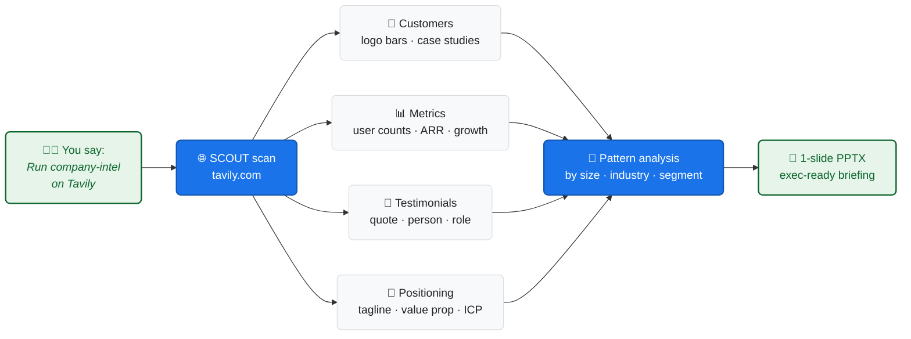

<div align="center">

# 🔍 AI Partner Ecosystem Analysis

### AI-Powered Company & Partner Research for Claude Code & GitHub Copilot

[]()
[](LICENSE)
[](docs/HOW-TO-USE.md)
[]()

**Created and maintained by [Varun Kulkarni](https://github.com/varunk130)**

Give your AI assistant the ability to deep-research any ISV, partner, or competitor by scanning their public website and producing a structured customer list, company profile, and an executive-ready 1-slide PowerPoint summary.

</div>

---

## 🔭 How It Works



---

## ⚡ Quickstart

```bash
# 1. Clone the repo
git clone https://github.com/varunk130/ai-partner-ecosystem-analysis.git

# 2. Install the company-intel skill (Claude Code)
cp -r ai-partner-ecosystem-analysis/skills/company-intel ~/.claude/skills/

# 3. In Claude Code, ask:
#      "Run company-intel on Tavily"
#      "Research https://www.clay.com"
#      "Who are Notion's enterprise customers?"
```

For **GitHub Copilot**: copy `skills/company-intel` into `.github/skills/` in your repo and invoke via natural language.

---

## What It Does

AI Partner Ecosystem Analysis is a Claude Code / GitHub Copilot skill that turns a company name or URL into actionable intelligence. Point it at any company's website and it will:

- **Find their customers** by scanning logo bars, case studies, and testimonials
- **Extract key metrics** like user counts, revenue claims, and growth stats
- **Capture testimonial quotes** with the person's name, title, and company
- **Summarize their positioning** including tagline, value prop, and differentiators
- **Analyze customer patterns** by size, industry, and segment
- **Generate a polished 1-slide PPTX** ready for exec review or internal briefing

---

## How to Use

### Step 1: Install the Skill

**Claude Code:**
```bash
git clone https://github.com/varunk130/ai-partner-ecosystem-analysis.git
cp -r ai-partner-ecosystem-analysis/skills/company-intel ~/.claude/skills/
```

**GitHub Copilot:**
```bash
git clone https://github.com/varunk130/ai-partner-ecosystem-analysis.git
cp -r ai-partner-ecosystem-analysis/skills/company-intel .github/skills/
```

### Step 2: Run It

Open your AI assistant and provide a company name or URL. That's it. The skill handles everything else.

**Example prompts:**

| What You Say | What Happens |
|-------------|-------------|
| `Run company-intel on Tavily` | Fetches tavily.com, extracts customers, builds a slide |
| `Research https://www.clay.com` | Scans Clay's site for customer logos, case studies, metrics |
| `Company intel on [any ISV name]` | Searches for the company, finds their site, runs the full [SCOUT framework](#scout-framework) |
| `Who are Company X's customers?` | Extracts and categorizes all featured customers |
| `Build me an intel slide on [partner name]` | Full research + 1-slide PPTX output |

### Step 3: Get Your Output

The skill produces two deliverables:

| Output | Format | What's In It |
|--------|--------|-------------|
| Research Notes | Markdown (.md) | Customer list, company profile, pattern analysis |
| Intel Slide | PowerPoint (.pptx) | Polished 1-slide summary with customers, metrics, and positioning |

---

## SCOUT Framework

The skill follows a 5-step research process:

```
  S ──── C ──── O ──── U ──── T
  │      │      │      │      │
  Scan   Capture Outline Uncover Tabulate
  │      │      │      │      │
  Fetch  Extract Build  Analyze Generate
  pages  customers profile patterns slide
```

| Step | What It Does | Output |
|------|-------------|--------|
| **S**can | Fetches homepage, /customers, /about, /pricing pages | Raw web content |
| **C**apture | Extracts customer names, logos, quotes, case studies | Structured customer table |
| **O**utline | Builds company profile: what they do, key metrics, audience | Company summary |
| **U**ncover | Analyzes patterns: customer size, industry, segments | Segmentation insights |
| **T**abulate | Compiles everything into a polished PowerPoint slide | 1-slide PPTX |

---

## Use Cases

### Pre-Meeting Research
> "I have a call with an ISV tomorrow. Run company-intel on their website so I know who their customers are and how they position themselves."

### Competitive Intelligence
> "Research our top 3 competitors and build intel slides for each. I want to see who they're selling to."

### Partner Evaluation
> "We're considering a partnership with Company X. Run company-intel to see their customer base and whether there's overlap with ours."

### Account Planning
> "Research this prospect's website and tell me what metrics they claim, who their customers are, and how they describe their product."

### Portfolio Review
> "Run company-intel on each of our top 10 ISV partners and build a slide for each."

---

## What the Skill Extracts

| Data Point | Where It Looks | Example |
|-----------|---------------|---------|
| Customer logos | Homepage "Trusted by" bars, footer logos | Company A, Company B, Company C |
| Case studies | /customers, /case-studies pages | "Company D increased pipeline by 3x" |
| Testimonial quotes | Homepage, customer pages | "This tool is essential" - Person A, VP Sales |
| Key metrics | Homepage hero, about page | "100M+ users", "10,000+ companies" |
| Positioning | Homepage headline, meta description | "The all-in-one platform for..." |
| Target audience | Messaging, customer types | Enterprise, Mid-Market, Developers |
| Partners/Integrations | Integration pages, footer badges | Listed technology partners |

---

## Slide Output Format

The generated PPTX follows this layout:

```
+------------------------------------------------------------------+
|  [COMPANY NAME]  Company Intelligence Brief          [Date]       |
|  [Tagline - 1 line]                                              |
+------------------------------------------------------------------+
|                           |                                       |
|   COMPANY OVERVIEW        |   FEATURED CUSTOMERS                  |
|                           |                                       |
|   What They Do:           |   Case Studies:                       |
|   [1-2 sentences]         |     Company A, Company B              |
|                           |   Logo Features:                      |
|   Key Metrics:            |     Company C, D, E, F, G, H          |
|   - Metric 1              |                                       |
|   - Metric 2              |   Notable Quote:                      |
|   - Metric 3              |   "[Quote]" - Person, Title           |
|                           |                                       |
+------------------------------------------------------------------+
|  Segments: [Enterprise] [Mid-Market] [Tech] [Finance]            |
+------------------------------------------------------------------+
```

Uses Microsoft Fluent design: navy header, Segoe UI typography, blue/teal accents.

---

## Tips for Best Results

- **Be specific:** "Run company-intel on https://www.clay.com" works better than "research clay"
- **Combine with other skills:** Pair with `battle-scanner` for competitive analysis or `gtm-exec-plan` for full GTM planning
- **Run on multiple companies:** Research 3-5 competitors in sequence to build a comparative landscape
- **Check multiple pages:** If the first scan misses customers, ask the skill to also check /partners or /integrations pages

---

## Requirements

| Requirement | Details |
|-------------|---------|
| AI Assistant | Claude Code or GitHub Copilot |
| Python | 3.9+ (only for PowerPoint generation) |
| python-pptx | `pip install python-pptx` (only for PPTX output) |

---

## License

This project is licensed under the MIT License. See the [LICENSE](LICENSE) file for details.

---

<div align="center">

**Built by Varun Kulkarni**

*Powered by Claude Code & GitHub Copilot*

</div>
